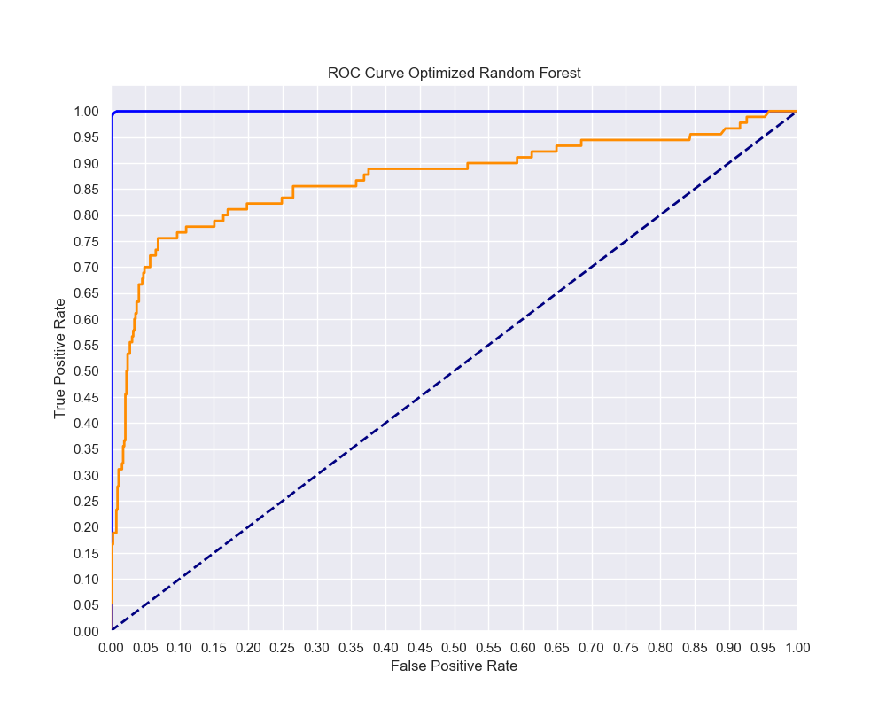
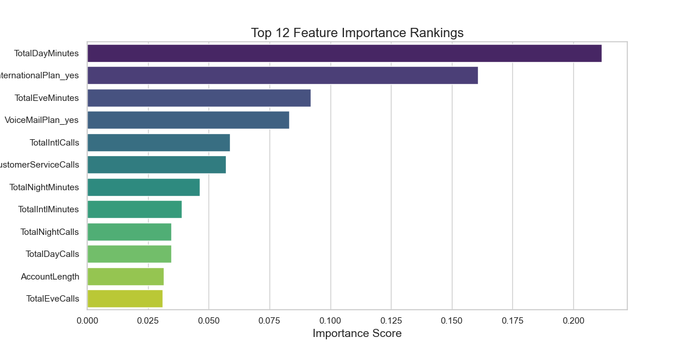

# Building a Machine Learning Classification Model to Predict Customer Churn

## Project Overview

This project examines a dataset from SyriaTel, a telecommunications company with the aim of using classification prediction machine learning modelling techniques, to predict the likelihood of a customer ceasing to do business with the company within a given period. This is referred to as **Churn** in the telco industry.Acquiring new customers involves huge marketing costs, that include huge advertising budgets and commissions to sales agents. It therefore becomes imperative to retain those customers once they are acquired. It is the motivation of every telco company to understand the features or characteristics of a customer who is likely to 'churn'. With this understanding, the company can get ahead of the problem, and develop initiatives that target these specific customers , to discourage them from ceasing doing business with the company.

## Business and Data Understanding

### Stakeholder Audience

SyriaTel is intentional about reducing the high cost of churn. With this Model, their Data Analtics, Marketing and Revenue Assurance departments will be able to:-
    + Identify the customer characteristics (features) that have the most impact on churn.
    + Use the best model identified from the modeling iterative process test future customers' data in order to predict the likelihood of a customer leaving the network.
    + Develop proactive retention strategies specifically targeted to 'at risk' customers to discourage them from leaving the network.

### The Dataset Choice

The SyriaTel data set consist of fairly straightforward and well formated data and is available on https://www.kaggle.com/  It has customer usage (minutes/number of calls/charges), customer choices of premium services columns (International and Voice Mail Plans), as well as other customer data like location, area code, phone number and account length https://www.kaggle.com/datasets/becksddf/churn-in-telecoms-dataset . Based on industry standards the following features from the data set are commonly associated with customer churn and will be considered as model features that have an impact on the target variable 'churn'.

+ **Usage Patterns:** 'total day minutes', 'total day calls','total eve calls', 'total eve minutes','total night calls','total night minutes','total intl calls', and 'total intl minutes' are critical columns for determining churn. High usage of calls and minutes can indicate customer engagement and satisfaction, while low usage might suggest dissatisfaction.

+ **Charges:** 'total day charge','total eve charge','total night charge', and 'total intl charge' are also important columns. Higher charges can lead to customer distasfaction if they feel they are not getting value for money.

+ **Service Quality:** Features like 'International plan' and 'voice mail plan' can reflect a very high expectation from customers who are enrolled in those plans, and can have a direct impact on satisfaction levels and therefore, churn.

+ **Customer Support:** 'customer service calls' a high number of customer service calls can indicate issues of service quality or customer dissatisfaction.

+ **Account Length:** The 'account length' feature is equally important as longer account lengths generally indicate customer loyalty, while shorter account lengths may suggest a higher likelihood of churn.

+ **Location:** Customer location indicated by the 'state' may have an effect on churn due to unique characteristics within the State like income levels, choice of networks etc, and will be tested early in the modeling to assess it's predictive power.If it is found to be having little or no predictive power, this feature will be dropped as multiple locations included in a model can make it very complex and less effecient.

The following features from the data set are deemed to have little or no predicted power and will be excluded from the model right from the start:

   + 'area code'
   + 'phone number'

## Modeling

In the modeling phase, I implemented 3 machine learning algorithms,using an iteractive process, starting with a baseline model Logistics Model all the way to a Random Forest Ensemble model. The modeling process is as as follows:

1. **Data Preprocessing** 
    + Cleaning the data, handling missing values, removing outliers and feature engineering. Feature engineering included dropping the columns like 'area code' and 'phonenumber'.
    + One-Hot-Encoding categorical columns - 'InternationalPlan','VoiceMailPlan','State'- into numerical columns
    + Checking for multicollinearity using a correlation matrix, and dropping one of the pair of columns with high correlation. I dropped all the 'total (day,evening,night,international) charges' columns as they were found to have a perfect correlation with the 'total(day,evening,night international) minutes' columns. Similarly 'NumberVmailMessages' was dropped because it was highly correlated with being on a voice plan - 'VoiceMailPlan_yes'
    + Standardizing feature columns using the StandardScaler. 
    + Splitting the data set into train and test sets at a ratio of 75.25, respectively.
    + Checking for class imbalance
    
2. **Model Selection**
I trained 3 different modeling algorithms - Logistic Regression, Decision Tree and Random Forest Models:-
    + Logistic Regression - I trained a baseline model, SMOTE oversampled model, models with select ed top features ranging from  top 5 to top 20, and a hyperparameter tuned model using GridSearchCV. I also performed cross validation to check for overfitting and underfitting. 
    +Decision Tree - I next trained a Baseline Decision Tree model followed by a pruned model. I used RandomSearchCV for the optimization.The optimized model showed better performance than the best logistic regression model. 
    +Random Forest Ensemble - This was the last iteration of the model forest.I used RandomSearchCV for tuning and the model produced the perfect train accuracy and AUC scores  and the highest Ttest scores.

3. **Class Imbalance** 
The dataset, as expected had a class imbalance problem with the majority class (non-churn) and the minority class(churn) at 89% and 11% respectively. To address this I used SMOTE (Synthetic Minority Over-sampling Technique) to generate sythetic samples of the minority class. This technique helps in improving the performance of machine learning models with class imbalanced in datasets.

4. **Feature Selection**
To further optimize the models, I trained a Random Forest Cassifier to determine feature importances and only carry forward to the next  modeling iterations only those fatures that have the best predictive power. From this process, the top 10 to 12 features offered the best balance between improving model performance and avoiding overfitting. I opted to carry on with the top 12 features that included all the usage features as well as the opt in features. All the 'states' features were found to have very low predicted features and were dropped from all the subsequent models.

5. **Cross Validatiion**
After the baseline Logistic Model, the SMOTE resampled Logistic Model and the dropping of the states based on feature importances, I used cross validation to further assess the performance and robustness of the training data. By averaging the results across multiple folds, cross-validation provides a more reliable estimate of the model's performance, and Helps ensure that the model's performance is not dependent on a particular train-test split. Both training and testing accuracies are fairly close, indicating the model does not significantly overfit or underfit the data.  Both training and test AUC values are high, showing the model's strong ability to distinguish between classes. Overall, the results are consistent across folds,with the model performing and generalizing well across folds.

6. **Hyperparameter Tuning**: 
    + To optimize the Logistic model i.e. chosing the best performing hyperparameters, I used GridSearchCV. All metrics improved after hyperparameter tuning, which suggests that the tuning process successfully enhanced the model's performance.The improvements are consistent across both training and testing datasets, which is a positive sign that the model's enhancements are not just resticted to training data. Testing accruacy increased as compared to the non-tuned SMOTE model to 0.84 from 0.57  and test AUC increased to 0.83 from 0.82.
    + To optimize the Decision Tree model, I used RandomizedSearchCV. Training a new model with the best parameters improved test accuracy in comparison to the baseline Decision Tree Model to 0.90 from 0.88, and test AUC to 0.84 from 0.78.  
    + To optimize the Random Forest Ensemble model, I used RandomSearchCV. After this optimization, the Ramdom Forest Model outperformed all the other models terms of accuracy and AUC on both the training and test sets. Though it has perfect training scores (1.0 for accuracy and AUC), it still has very good testing scores(Accuracy of 0.92 and AUC of 0.85), which is an indication of a good generalization to unseen data.The Random Forest Ensemble model is theredore the best performing model, from this iterative process.
    

## Evaluation

The evaluation of the models was conducted based on the following metrics:-
    + Accuracy is a measure of how often the model gets the prediction right, and in this case measures how often the model correctly predicts whether a customer will churn or not. A test accuracy score of 0.92 from the best Random Forest Ensemble Model means that our model was able to predict correctly 92% of the time.
    + AUC evaluates the ability of the model to differentiate between customers who churn and those who don't, across all possible threshold settings - ranging from conservative (label fewer customers as churners) to more aggressive (label more customers as churners). An AUC of 0.5 means the model is no better than random guessing while an AUC of 1.0 means the model perfectly distinguishes between churners and non-churners. The test AUC of 0.87 from the best model - Random Forest Ensemble Model means that there is an 87% chance that the model will correctly rank a randomly chosen churner higher than a randomly chosen non-churner.
    + ROC (Receiver Operating Characteristic) Curve is a graphical representation used to evaluate the performance of a binary classification model. It plots the True Positive Rate (TPR) against the False Positive Rate (FPR) at various threshold settings. The diagonal Line represents a random guess with no discriminative ability (AUC = 0.5), while the curved line represent the models' performance; The more the curved line hugs the top-left corner, the better better the model's performance.
    
 **Accuracy and AUC scores for the 3 models
    
  Metric            |   Best Logistic Model |   Pruned Decision Tree Model |   Random Forest Ensemble Model |
|:------------------|----------------------:|-----------------------------:|-------------------------------:|
| Training Accuracy |                  0.85 |                         0.96 |                           1.00    |
| Testing Accuracy  |                  0.84 |                         0.90 |                           0.92 |
| Train AUC         |                  0.91 |                         0.99 |                           1.00    |
| Test AUC          |                  0.83 |                         0.84 |                           0.87 |  

The results indicated that the Random Forest Ensemble Model has the highest Accuracy and the highest AUC.

## Conclusion

The provided historical data indeed has predictive power in determing customer churn. The Hyperparameter tuned Logistic regression model, the Pruned Decision Tree Model and the Random Forest Ensemble Model have shown the ability to predict churn with moderately high to very high accuracy and AUC scores. The following is a visualization on the predictive power of the features used in the modeling:

The best performing model was the **Random Forest Ensemble** with a perfect Training Accuracy and AUC scores. The test Accuracy is at 92% while the test AUC is 87%. This model once deployed on new customer data will be able to predict with a high degree of accuracy the likelihood of a customer to churn.

This predictive power is a poerful tool that can help SyriaTel to identify **'at risk'** customers, before it is too late and develop proactive customer retention strategies. The feature importances further help the company to identify specific customer characteristics that could potentially lead to churn. These include:

   + Customers with high usage as indicated by Total Day Minutes and Total Evening Minutes are at a higher risk of churn. The usage patterns during the day give the highest predictive power.
    + Premium customers indicated by enrolment into the International Call Plan also has significant impact on churn. Voice Mail Plan enrolment also has a strong impact.
    + Customer Service Calls also have an impact on churn, meaning a customer calling customer service more is more likely to churn.
    + The frequency or number of calls as indicated by the number of calls also has an impact, though to a lower extent that the actual time spent on the call.

## Next Steps

Going forward, the SyriaTel will  update the model with new data to maintain accuracy and adapt to any changes in customer behavior.These updates may result in a new choice of model selection.  
